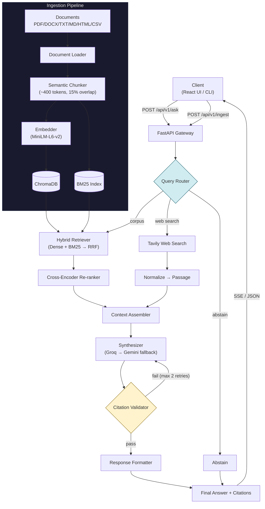

# Research Agent with Citations

A production-grade RAG system that takes a question + a document corpus and produces a synthesized, per-claim-cited answer — or an explicit abstention when evidence is insufficient. Every factual claim is traceable to a specific source passage — an answer without a citation is treated as an answer that doesn't exist.

## ✨ Features

- **Hybrid Retrieval**: Dense embeddings (ChromaDB) + BM25 keyword search, merged via Reciprocal Rank Fusion (RRF).
- **Contextual Chunking**: Anthropic-style context prefixes on every chunk for dramatically better retrieval.
- **Cross-Encoder Re-ranking**: MS-MARCO re-ranker for precision on top-k results.
- **Citation Validation**: Programmatic checks with bounded retry — every `[n]` marker is verified via self-reflection.
- **Multi-Provider LLM**: Groq primary (llama-3.3-70b-versatile) → Gemini fallback chain (gemini-2.0-flash).
- **Web Search Fallback**: Tavily integration when the corpus is insufficient.
- **Abstention**: Explicit "I don't know" when evidence is lacking, preventing hallucinations.
- **Streaming**: SSE-based real-time token streaming.
- **Full UI**: React frontend with clickable citations, drag-drop upload, and chat history.

---

## 🏗 Architecture Overview

The system follows a modular, agentic Retrieval-Augmented Generation (RAG) pipeline:



---

## 📂 Project Structure

```text
Research_Agent/
├── backend/
│   ├── api/               # FastAPI route handlers
│   ├── chunking/          # Semantic, paragraph-aware chunking
│   ├── indexing/          # ChromaDB, BM25, and Embedder wrappers
│   ├── llm/               # Base LLM clients (Groq, Gemini) & Fallback routing
│   ├── loaders/           # Document parsing (PDF, DOCX, TXT, MD, HTML, CSV)
│   ├── models/            # Shared Pydantic schemas (Passages, Citations)
│   ├── pipeline/          # RAG components (Router, Assembler, Synthesizer, Validator, Orchestrator)
│   ├── prompts/           # LLM system prompts and formatting rules
│   ├── retrieval/         # Hybrid Retrieval (RRF) and Cross-Encoder Re-ranking
│   ├── storage/           # SQLite database for Q&A history
│   ├── tools/             # Tavily Web Search integration
│   ├── cli.py             # Typer CLI application
│   ├── config.py          # Environment settings
│   └── main.py            # FastAPI entry point
│
├── frontend/              # React + Vite application
│   ├── src/
│   │   ├── components/    # AskPanel, AnswerView, SourceLibrary, CitationPanel
│   │   ├── hooks/         # useSSE, useDocuments
│   │   └── store/         # AppContext
│
├── sample_docs/           # Demo corpus for testing
├── tests/                 # Unit and end-to-end testing suite
├── Dockerfile             # Multi-stage build for Backend & Frontend
└── docker-compose.yml     # Container orchestration
```

---

## 🚀 Quick Start

### Option 1: Docker Compose (Recommended)

The easiest way to run the entire stack (Frontend + Backend + VectorDB):

1. **Configure API Keys**
   ```bash
   cp .env.example .env
   # Edit .env with your GROQ_API_KEY, GOOGLE_API_KEY, TAVILY_API_KEY
   ```

2. **Run with Docker Compose**
   ```bash
   docker-compose up -d --build
   ```

3. **Access the Application**
   - UI: [http://localhost:5173](http://localhost:5173)
   - API Docs: [http://localhost:8000/docs](http://localhost:8000/docs)

*(Data is persisted automatically in the `./.data` directory.)*

### Option 2: Local Development Setup

#### 1. Backend Setup

```bash
# Clone and enter directory
cd Research_Agent

# Create and activate virtual environment
python -m venv research_env
research_env\Scripts\activate  # Windows
# source research_env/bin/activate  # Mac/Linux

# Install dependencies
pip install -e .

# Setup env variables
cp .env.example .env
```

#### 2. Start the Backend API
```bash
uvicorn backend.main:app --reload --port 8000
```

#### 3. Start the Frontend UI
```bash
cd frontend
npm install
npm run dev
```
Access the frontend at `http://localhost:5173`.

---

## 💻 CLI Commands

The system includes a powerful CLI `research-agent` for terminal usage:

```bash
# Ingest a single file or entire directory
research-agent ingest sample_docs/ai_transformers_overview.md
research-agent ingest sample_docs/

# Ask a question strictly from the local corpus
research-agent ask "What is the attention mechanism in transformers?"

# Ask a question with web search enabled
research-agent ask "What is the current price of Bitcoin?" --web

# View ingested documents and history
research-agent documents
research-agent history
```

---

## ⚖️ Tradeoffs & Design Decisions

| Decision | Chosen | Alternative | Why |
|---|---|---|---|
| **Retrieval** | Hybrid (Dense + BM25 + RRF) | Pure dense | Exact-match terms (dates, IDs, names) are critical for citations; BM25 catches what embeddings miss. |
| **LLM** | Groq primary + Gemini fallback | Single provider | Resilience — Groq is fast but rate-limited; Gemini ensures availability. |
| **Vector store** | ChromaDB (embedded) | FAISS / Pinecone | Zero-ops, persistent, metadata filtering — matches single-node scope perfectly. |
| **Chunking** | Semantic (paragraph boundaries) | Fixed character split | Prevents facts from being severed at arbitrary boundaries. |
| **Retry cap** | Max 2 citation retries | Unbounded | KISS — unbounded retries trade cost/latency for marginal gains. |
| **Re-ranker** | Cross-encoder (optional) | No re-ranker | Significant quality boost for small cost; can be disabled if needed. |
| **Frontend** | React + Vite | Jinja2 server-rendered | Enables rich streaming UX, clickable citations, and modern interactions. |
| **State management** | React Context | Redux / Zustand | Sufficient for scope; avoids YAGNI framework overhead. |

### ⚠️ Known Failure Modes
- **OCR-quality scanned PDFs**: Can lead to degraded chunk quality. Mitigated via error logging and manual review.
- **Extremely long documents**: May exceed the assembler's token budget. Mitigated by passage-level truncation and top-k caps.
- **Groq Rate Limits**: Strict limits can cause 429s. Mitigated by the robust Gemini fallback chain.
- **BM25 Cold Start**: The first query after a cold boot loads the BM25 index from disk, which adds a few milliseconds of latency.

---

## 📄 License
MIT
