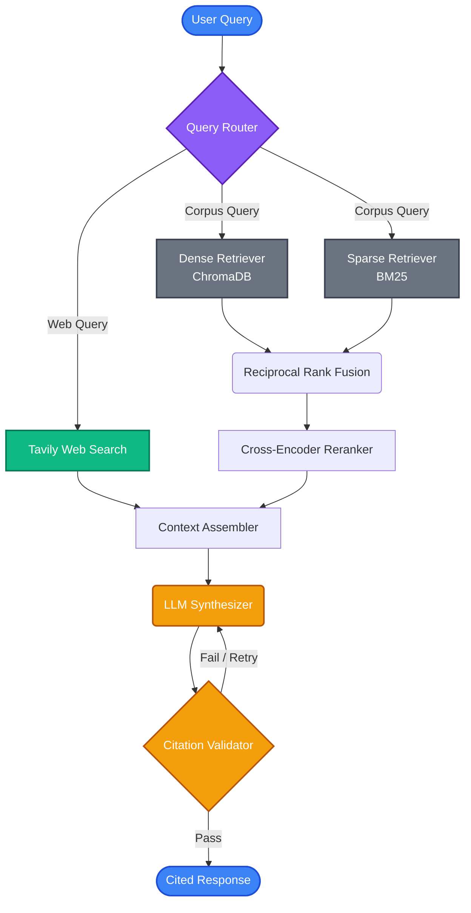

# Research Agent with Citations

A production-grade RAG system that answers questions with **per-claim citations**, grounded strictly in a defined evidence set. Every factual claim is traceable to a specific source passage — an answer without a citation is treated as an answer that doesn't exist.

## ✨ Features

- **Hybrid Retrieval**: Dense embeddings (ChromaDB) + BM25 keyword search, merged via Reciprocal Rank Fusion (RRF).
- **Contextual Chunking**: Anthropic-style context prefixes on every chunk for dramatically better retrieval.
- **Cross-Encoder Re-ranking**: MS-MARCO re-ranker for precision on top-k results.
- **Citation Validation**: Programmatic checks with bounded retry — every `[n]` marker is verified via self-reflection.
- **Multi-Provider LLM**: Groq primary → Groq secondary → Gemini fallback chain.
- **Web Search Fallback**: Tavily integration when the corpus is insufficient.
- **Abstention**: Explicit "I don't know" when evidence is lacking, preventing hallucinations.
- **Streaming**: SSE-based real-time token streaming.
- **Full UI**: React frontend with clickable citations, drag-drop upload, and chat history.

---

## 🏗 Architecture

The system follows a modular, agentic Retrieval-Augmented Generation (RAG) pipeline:



1. **Query Router**: Determines if the question requires the internal corpus or an external web search.
2. **Hybrid Retriever**: Queries ChromaDB (semantic) and BM25 (keyword).
3. **RRF & Reranker**: Merges results mathematically, then uses a cross-encoder to compute true relevance scores.
4. **Context Assembler**: Formats the top passages into a strict XML structure.
5. **Synthesizer**: Uses an LLM to generate the answer with inline citations `[1]`.
6. **Citation Validator**: A secondary LLM pass (or programmatic check) ensuring every citation corresponds exactly to the provided XML chunks.

---

## 🚀 Quick Start

### Option 1: Docker Compose (Recommended)

The easiest way to run the entire stack (Frontend + Backend + VectorDB):

1. **Configure API Keys**
   ```bash
   cp .env.example .env
   # Edit .env with your GROQ_API_KEY, GOOGLE_API_KEY, TAVILY_API_KEY
   ```

2. **Run with Docker Compose**
   ```bash
   docker-compose up -d --build
   ```

3. **Access the Application**
   - UI: [http://localhost:5173](http://localhost:5173)
   - API Docs: [http://localhost:8000/docs](http://localhost:8000/docs)

*(Data is persisted automatically in the `./.data` directory.)*

### Option 2: Local Development Setup

#### 1. Backend Setup

```bash
# Clone and enter directory
cd Research_Agent

# Create and activate virtual environment
python -m venv research_env
research_env\Scripts\activate  # Windows
# source research_env/bin/activate  # Mac/Linux

# Install dependencies
pip install -e .

# Setup env variables
cp .env.example .env
```

#### 2. Start the Backend API
```bash
uvicorn backend.main:app --reload --port 8000
```

#### 3. Start the Frontend UI
```bash
cd frontend
npm install
npm run dev
```
Access the frontend at `http://localhost:5173`.

---

## 💻 CLI Commands

The system includes a powerful CLI `research-agent` for terminal usage:

```bash
# Ingest a single file or entire directory
research-agent ingest sample_docs/ai_transformers_overview.md
research-agent ingest sample_docs/

# Ask a question strictly from the local corpus
research-agent ask "What is the attention mechanism in transformers?"

# Ask a question with web search enabled
research-agent ask "What is the current price of Bitcoin?" --web

# View ingested documents and history
research-agent documents
research-agent history
```

---

## 🛠 Tech Stack

| Component | Technology |
|---|---|
| **LLM (Primary)** | Groq (llama-3.3-70b-versatile + mixtral-8x7b-32768) |
| **LLM (Fallback)** | Google Gemini (gemini-2.0-flash) |
| **Embeddings** | sentence-transformers (all-MiniLM-L6-v2) |
| **Vector Store** | ChromaDB (embedded, persistent) |
| **Keyword Index** | BM25 (rank_bm25) |
| **Re-ranker** | Cross-Encoder (ms-marco-MiniLM-L-6-v2) |
| **Web Search** | Tavily API |
| **API Framework** | FastAPI + SSE (Server-Sent Events) |
| **Frontend** | React + Vite + Tailwind CSS |
| **Storage** | SQLite |

---

## ⚠️ Tradeoffs & Known Limitations

- **Hybrid > pure-dense**: BM25 catches exact-match terms (dates, IDs, names) that embeddings miss, but adds a slight overhead.
- **Capped retries (max 2)**: Unbounded self-correction loops trade cost/latency for marginal gains. We cap at 2 retries.
- **Single-node scope**: ChromaDB is in-process; for horizontal scaling, you would need a hosted vector database.
- **Context budget**: Extremely long documents may exceed the assembler's token budget, leading to truncation.

## 📄 License
MIT
